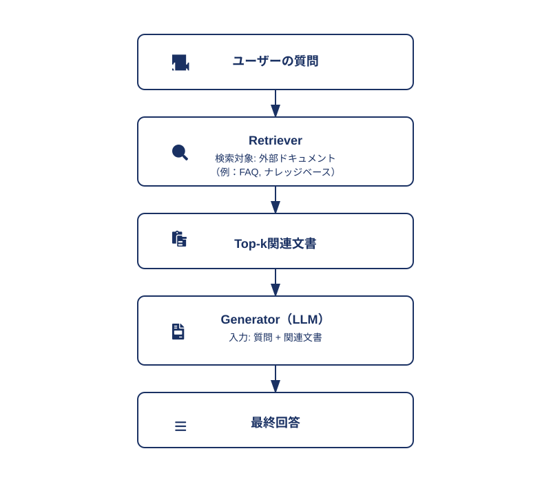
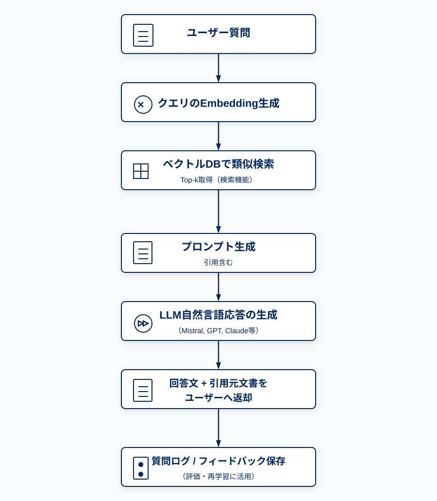

# 1. 概要

RAG（Retrieval-Augmented Generation）は、大規模言語モデル（LLM）と外部知識ソースを統合し、回答生成の精度と信頼性を向上させる手法です。

LLM単体では学習時点までの知識しか持たないため、動的情報やドメイン固有情報への対応に限界があります。RAGは検索エンジン（Retriever）を用いて、質問に関連する文書を動的に取得し、その文脈をLLMに与えて回答を生成する構成になっています。

# 2. アーキテクチャ構成

# 3. 処理ステップ

## ① ドキュメント前処理（準備段階）
- 文書を適切な長さにチャンク分割  
- 各チャンクに対して Embedding（ベクトル化）  
- ベクトルデータをベクトルデータベース（例: FAISS, Chroma）に保存  

## ② 質問処理（推論時）
- ユーザーの質問もベクトル化し、類似度検索で関連チャンクを取得  
- 検索結果とともにプロンプトを構成し、LLMに入力  
- LLMが文脈に基づいて自然言語で回答を生成  

# 4. 技術要素

| コンポーネント              | 技術例                                           | 補足                         |
|--------------------------|------------------------------------------------|----------------------------|
| 埋め込みモデル（Embedding） | `sentence-transformers`, `multilingual-e5` など | 意味的な近さをベクトル空間で表現 |
| ベクトルDB                 | FAISS, Chroma, Weaviate, Qdrant               | 類似検索を高速に実行             |
| Retriever                | `similarity_search(k=3)`                      | 上位k件の類似チャンクを取得         |
| Generator                | OpenAI GPT, Mistral, LLaMA など                 | 回答文を生成                     |

# 5. RAGの利点と課題

✅ **メリット**  
- モデルの知識に依存しないため、最新情報やカスタムドメインに対応可能  
- 応答の根拠をトレース可能で、説明責任を担保しやすい  

❌ **課題**  
- 検索精度が低いと誤情報を生成する  
- LLMのトークン制限を超えると文脈欠落が発生  
- 高負荷なパイプライン構成（検索+生成）で推論コストが高くなる  

---

# RAGシステム設計

## 1. システム概要

- **システム名**：社内FAQ検索AI  
- **目的**：LLMと社内文書検索を組み合わせた自動応答システムの構築  
- **想定ユーザー**：従業員（非エンジニア）  

---

## 2. 機能要件

| 項番  | 機能名         | 説明                          |
|-----|----------------|-------------------------------|
| 1 | 質問入力UI     | ユーザーからの自然言語入力        |
| 2 | 類似文書検索     | ベクトルDBを用いたtop-k検索       |
| 3 | 応答生成       | LLMによる自然言語応答           |
| 4 | 出典表示       | 回答に使用した文書のリンク提示     |

---

## 3. 非機能要件

- 日本語対応
- GPU環境での推論（ローカル or クラウド）  
- 文書更新の簡易性（再学習不要）  

---

## 4. データフロー

1. ユーザーが自然言語で質問  
2. 質問をベクトル化 → 類似文書を検索  
3. LLMにプロンプトと文書を渡して応答生成  
4. 回答と引用元を返却  

---

## 全体処理フロー図

---

# 機能設計

## 1. 🔍 検索機能（Retriever）

| 機能名             | 説明                                         |
|------------------|--------------------------------------------|
| 文書チャンク分割       | 文書を意味単位でトークン制限内に分割                     |
| 意味ベクトル生成       | Embeddingモデルでチャンクをベクトル化                   |
| ベクトルDB登録        | FAISS / Chroma / Qdrant などに格納                |
| 類似度検索（Top-k）  | 質問ベクトルに近いチャンクを取得                      |
| 高速インデックス再構築 | 文書の更新に即時対応                               |

## 2. 🧠 応答生成機能（Generator）

| 機能名               | 説明                                                   |
|--------------------|------------------------------------------------------|
| プロンプトテンプレート生成 | 検索結果を含んだLLM向け入力構築                              |
| 応答文生成             | LLM（APIまたはローカル）による自然文出力                        |
| 引用・出典付与         | 回答に使用した文書タイトル・リンクを添付                        |
| 出力形式選択           | Markdown / JSON / 要約形式などに切り替え可                      |

## 3. 💾 文書管理機能

| 機能名             | 説明                                                   |
|------------------|------------------------------------------------------|
| PDF, Word, HTML取込 | 各種文書形式に対応した取込と変換                            |
| 文書更新検知         | 差分更新または手動更新トリガー                              |
| メタデータ付与       | 出典情報、カテゴリ、更新日などの管理                          |
| バージョン管理       | 文書履歴と検索インデックスの整合性維持                          |

## 4. 🔐 セキュリティ・認証

| 機能名           | 説明                                                |
|----------------|---------------------------------------------------|
| ユーザー認証       | JWT / OAuth2 / SSO 対応                             |
| アクセス制御       | ロールごとの検索・閲覧制限                              |
| ログ記録         | 質問履歴・回答ログの保存と監査                          |
| 機密文書マスキング   | 特定情報の抽出・非表示対応                               |

## 5. 📈 管理・運用支援

| 機能名             | 説明                                                   |
|------------------|------------------------------------------------------|
| 検索ヒット率分析       | ユーザー質問と検索文書の一致度分析                            |
| 回答満足度評価         | フィードバックUI or ボタン（👍👎）実装                        |
| 文書未カバー検知       | 回答できなかった質問の分析と文書改善支援                        |
| 管理画面（CMS）       | 文書・ログ・モデルの状態可視化と操作                            |

## 6. 🌐 API連携・拡張性

| 機能名               | 説明                                         |
|--------------------|--------------------------------------------|
| REST / GraphQL API | 質問・検索・生成をAPI経由で提供                   |
| Web UI埋め込み        | iframe or SDK で既存サービスに統合               |
