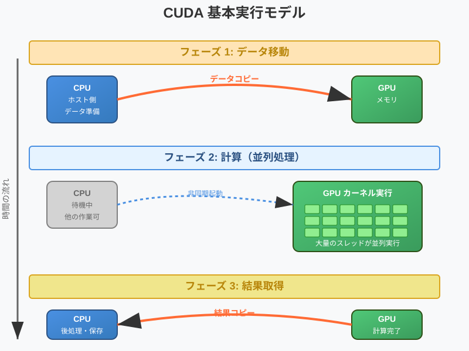
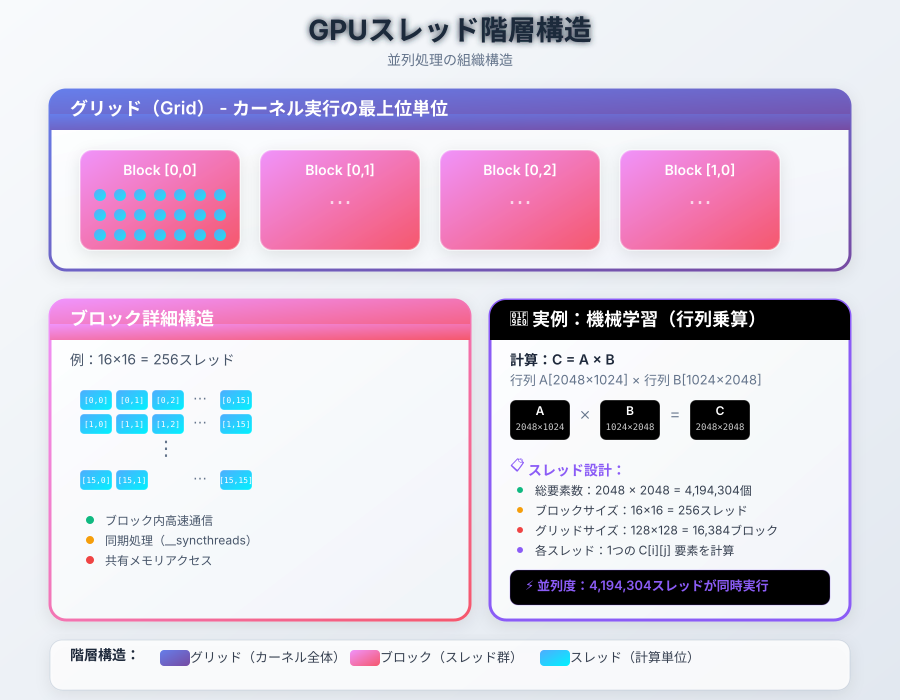

## CPUとGPUの処理関係

## CUDAの基本実行モデルフェーズ

### フェーズ1（データ移動）
CPUで準備したデータをGPUメモリにコピーします。  
(ストレージ → CPUメモリ → GPUメモリ)  
オレンジ色の矢印で、ホスト側からGPU側へのデータ転送を示しています。

### フェーズ2（計算）
GPUで大量のスレッドが並列に計算を実行している間、CPUは待機状態（グレー表示）になっているか、他の作業を行えます。  
青い点線矢印は非同期起動を表現し、GPU内の緑色の小さな四角形は並列実行されるスレッドを表しています。

### フェーズ3（結果取得）
計算が完了したらGPUからCPUへ結果をコピーし、CPUが後処理や保存を行います。

