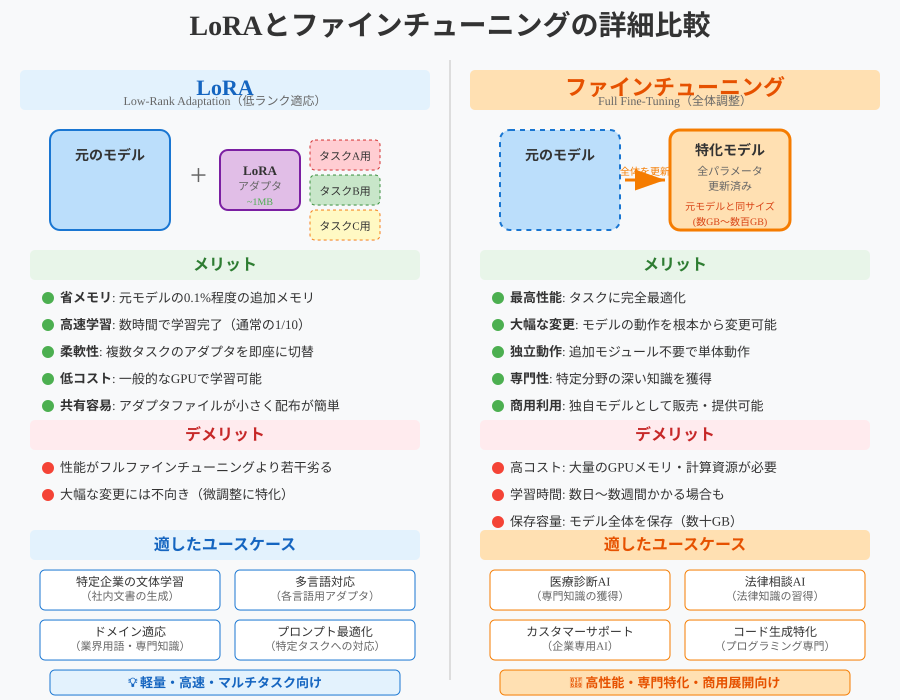

# LoRA 概要：特定ドメインに最適なファインチューニング

##  LoRAとは？

**LoRA（Low-Rank Adaptation）**は、大規模言語モデル（LLM）に対して**極めて少ない追加パラメータ**でタスク適応（ファインチューニング）を可能にする手法です。

- 元のモデルの重みは一切変更せず、特定の線形層に**小さな補正行列**を加えるだけ
- 高速・省メモリ・低コストでの学習が可能

---

##  特定ドメインFAQ応答にLoRAが適している理由

### 1. **低コストでドメイン特化**
- 通常のLLMファインチューニングに比べて学習パラメータが数%以下
- 社内データやFAQログなど、**小規模なデータ**で十分に効果を発揮
- 1枚のGPU（例：A100, RTX 3090）でも十分に学習可能

### 2. **モデル本体はそのまま**
- 元のLLMはそのまま保存され、LoRAパラメータだけ別管理できる
- これにより、**複数業種・部門ごとのFAQモデルを効率よく運用可能**

### 3. **応答品質の向上**
- LoRAは特定の用語・言い回し・口調などをモデルに埋め込みやすく、
  **FAQ応答の一貫性・専門性が向上**

---

##  代表的なユースケース

| ユースケース | 説明 |
|--------------|------|
|  FAQ応答 | 部門ごとの問い合わせに応じた応答の最適化 |
|  カスタマーサポート | サービス別・顧客別の回答チューニング |
|  チャットボットの専門化 | 金融・医療・法務など専門用語対応 |
|  ドメイン知識の注入 | RAGなどと組み合わせて、生成精度向上 |

---

# LoRAと従来のファインチューニングの比較表


| 項目                           | LoRA                                      | 従来のファインチューニング                |
|--------------------------------|-------------------------------------------|--------------------------------------------|
| 学習パラメータ量              | 非常に少ない（全体の1～3%程度）          | モデル全体（数十億以上）                  |
| 計算コスト（GPUメモリなど）   | 低コスト・省メモリ                        | 高コスト・大量のGPUメモリが必要           |
| モデルの重み更新              | 一部（低ランク補正項）のみ                | 全体を更新                                 |
| 学習速度                      | 速い（数時間で完了可能）                  | 遅い（長時間学習が必要）                   |
| ベースモデルへの影響          | なし（元のモデルは固定）                  | あり（モデル全体が上書きされる）           |
| 複数タスクへの対応            | 容易（LoRAのアダプターを切り替えるだけ） | 各タスクごとにモデルを別途保存・管理      |
| 適した用途                    | 特定ドメインの軽量な適応（例：FAQ応答）  | モデル全体を新しい用途に完全適応させたい場合 |
| 維持・運用コスト              | 低い                                      | 高い                                       |
| モデルの公開・配布            | 小さなLoRAパラメータだけで済む            | 巨大なモデル全体を再配布する必要あり       |

---

##  実装例（Hugging Face Transformers + PEFT）

```python
from transformers import AutoModelForCausalLM, AutoTokenizer
from peft import get_peft_model, LoraConfig, TaskType

# ベースモデルのロード（例：LLaMAなど）
model = AutoModelForCausalLM.from_pretrained("llama_model_path")
tokenizer = AutoTokenizer.from_pretrained("llama_model_path")

# LoRA設定
lora_config = LoraConfig(
    r=8,
    lora_alpha=16,
    target_modules=["q_proj", "v_proj"],
    lora_dropout=0.05,
    bias="none",
    task_type=TaskType.CAUSAL_LM
)

# LoRAモデルの構築
model = get_peft_model(model, lora_config)
```

| 引数名              | 意味                                 |
| ---------------- | ---------------------------------- |
| r              | 低ランク次元数。学習パラメータ量を決める主な要素           |
| lora_alpha     | スケーリング係数。出力の安定化のために使う              |
| target_modules | LoRAを適用する層（通常は `q_proj`, `v_proj`） |
| lora_dropout  | Dropoutによる正則化（訓練時のみ有効）             |
| bias           | バイアス項の扱い方（多くの場合 `"none"` で問題なし）    |
| task_type      | モデルのタスク種別。言語生成系は `CAUSAL_LM`       |
