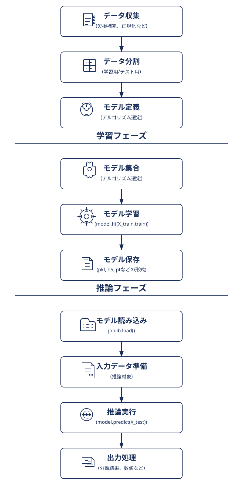

# 📘 機械学習の基礎

---

## ✅ 学習と推論の目的

| 観点 | 学習（Training） | 推論（Inference） |
|------|------------------|--------------------|
| 目的 | モデルを構築する（最適なパラメータを学ぶ） | 新しいデータに対して予測を行う |
| 入力 | 特徴量（X） + 正解ラベル（y） | 特徴量（X）のみ |
| 出力 | 学習済みモデル（重み・構造） | 予測結果（分類ラベル、数値など） |
| 処理内容 | 最適化（誤差最小化、勾配降下など） | 学習済み関数を使って出力を計算する |
| 負荷 | 計算量が多い（GPUや大量メモリが必要） | 比較的軽量（高速に動く） |
| 頻度 | 一度 or 定期的に実施 | 毎回の入力に対して都度実施 |

---

## ✅ 学習モデル開発サイクル

| フェーズ | 主な処理 |
|----------|--------------------------|
| モデル開発フェーズ | データ準備 → 学習 → 検証 → モデル保存 |
| 実運用フェーズ | 保存したモデルを読み込み → 推論を実行 |
| 再学習フェーズ | 新データで再学習（モデル更新） |

---

## ✅ 機械学習の全体フロー（学習 → 推論）

---

## ✅ 学習アルゴリズム一覧

| 種類 | 主な目的 |
|------|------------|
| 教師あり学習 | ラベル付きデータ → 予測 |
| 教師なし学習 | ラベルなしデータ → 構造抽出 |
| 強化学習 | 行動の最適化 |
| 半教師あり学習 | 一部ラベル付き → 補完学習 |
| オンライン学習 | 継続的に学習 |
| アンサンブル学習 | 複数モデルを組み合わせて強化 |
| 深層学習 | 大規模・複雑な特徴抽出・予測 |

---

## ✅ 推論アルゴリズムの種類

| 推論の種類 | 説明・出力例 | 主な用途 |
|------------|--------------|------------|
| 分類 | ラベル出力 | スパム判定、離脱予測 |
| 回帰 | 数値出力 | 売上・株価予測 |
| クラスタリング | グループID出力 | セグメンテーション |
| 異常検知 | 正常 or 異常判定 | 不正検出 |
| 次元削減 | 圧縮ベクトル出力 | 可視化・高速化 |
| 時系列予測 | 未来値出力 | 気温・在庫予測 |
| 自然言語処理（生成） | テキスト出力 | 要約、翻訳 |
| 画像生成 | 画像出力 | 顔生成、デザイン |
| 意思決定 | 行動選択 | ゲーム、制御系 |

---

## ✅ 各手法の詳細

### 1. 教師あり学習（Supervised Learning）

**使う場面:**
- 過去データから将来を予測したい
- 「〇〇なら××である」という関係性を見つけたい
- ラベル付きデータがある
- 数値予測や分類問題に対応したい

**ビジネスシーン:**
- 売上予測
- 顧客離反予測
- 与信スコアリング
- メール振り分け

#### 分類（Classification）

| アルゴリズム | 特徴 |
|--------------|------|
| ロジスティック回帰 | シンプルで解釈性が高い |
| 決定木 | 解釈しやすいが過学習しやすい |
| ランダムフォレスト | 決定木の集合体で精度安定 |
| 勾配ブースティング系 | 実務で広く使われ高精度 |
| SVM | 高次元・少数データに強い |
| k-NN | 単純だが大規模データに非効率 |
| ニューラルネット（MLP） | 高表現力だが深層化が必要 |

#### 回帰（Regression）

| アルゴリズム | 特徴 |
|--------------|------|
| 線形回帰 | 高速で解釈しやすい |
| リッジ / ラッソ回帰 | 正則化ありで過学習防止 |
| 決定木回帰 | 非線形に強い |
| ランダムフォレスト回帰 | 欠損値に強く高精度 |
| 勾配ブースティング回帰 | 非線形に強く実務向き |
| SVR | 小規模データ向き |
| ニューラルネット回帰 | 非線形・大規模に強い |

---

### 2. 教師なし学習（Unsupervised Learning）

**使う場面:**
- パターンや構造の発見
- 異常検知や次元削減
- セグメンテーション

**ビジネスシーン:**
- 顧客セグメンテーション
- 在庫異常検知
- 類似商品グルーピング

#### クラスタリング

| アルゴリズム | 特徴 |
|--------------|------|
| k-means | シンプル・高速・初期値依存あり |
| DBSCAN | ノイズに強くクラスタ数不要 |
| 階層クラスタリング | 可視化しやすい |

#### 次元削減

| アルゴリズム | 特徴 |
|--------------|------|
| PCA | 線形変換・可視化向き |
| t-SNE / UMAP | 非線形で構造保持に強い |

---

### 3. 強化学習（Reinforcement Learning）

**使う場面:**
- 試行錯誤による最適化
- 長期報酬最大化
- 環境に応じた意思決定

**ビジネスシーン:**
- 生産ライン最適化
- 電力消費制御
- 動的価格設定

| アルゴリズム | 特徴 |
|--------------|------|
| Q-Learning | 基本的価値ベース |
| DQN | 深層学習を併用したQ-Learning |
| PPO | 安定・汎用的でOpenAI使用例あり |
| A2C / A3C | 並列学習可能なActor-Critic法 |

---

### 4. 半教師あり学習（Semi-Supervised Learning）

**使う場面:**
- ラベル付けコスト削減
- ラベルなしデータ活用
- 精度向上

**ビジネスシーン:**
- 少量のラベルデータ活用
- サンプル分析

| 手法 | 特徴 |
|------|------|
| Pseudo-labeling | 予測結果で再学習 |
| FixMatch / MixMatch | ノイズ耐性・高精度な画像分類に |

---

### 5. オンライン学習（Online Learning）

**使う場面:**
- 継続的にデータが流入
- リアルタイム学習が必要
- ストリーミング処理

**ビジネスシーン:**
- 取引監視
- 動的レコメンド
- 常時需要予測

| 手法 | 特徴 |
|------|------|
| SGD | 増分学習・大規模データ対応 |
| Passive-Aggressive | 即時更新・高速 |

---

### 6. アンサンブル学習（Ensemble Learning）

**使う場面:**
- 単一モデルの限界超え
- 精度安定性・堅牢性向上
- 過学習リスク低減

**ビジネスシーン:**
- 経営判断支援
- リスク評価

| 手法 | 特徴 |
|------|------|
| ランダムフォレスト | バギング・安定性高 |
| XGBoost / LightGBM | 実務向きブースティング |
| Stacking | 複数モデル出力を統合 |

---

### 7. 深層学習（Deep Learning）

**使う場面:**
- 非構造データの処理
- 高度な特徴抽出
- エンドツーエンド学習

**ビジネスシーン:**
- テキスト/音声/画像処理
- 複雑な予測・生成

| 用途 | モデル例 |
|------|----------|
| 画像処理 | CNN（ResNet、EfficientNet） |
| 自然言語処理 | Transformer（BERT、GPT、T5） |
| 時系列予測 | LSTM、GRU |
| 生成モデル | GAN、Diffusion |
| 自己教師学習 | SimCLR、BYOL |

---

## ✅ 推論の実行形式による分類

| 推論形式 | 説明 | 主な利用シーン | 処理タイミング |
|----------|------|----------------|----------------|
| バッチ推論 | 一括処理 | レポート生成 | 定期実行 |
| リアルタイム推論 | 即時処理 | チャット、レコメンド | 都度処理 |
| ストリーム推論 | 常時処理 | IoT、監視カメラ | 継続処理 |

---

## ✅ 実行環境による推論のメリット・デメリット

### クラウド推論
- メリット: 高性能、スケーラブル、統合容易
- デメリット: ネットワーク依存、コスト高、セキュリティ制約

### エッジ推論
- メリット: 低遅延、プライバシー保護、ネットワーク不要
- デメリット: リソース制限、モデル軽量化必要、更新が煩雑

### ローカル推論
- メリット: 高セキュリティ、法規制対応、柔軟な構成
- デメリット: ハード管理必要、コスト高、スケールしにくい

---

## ✅ 推論の実行環境による分類

| 実行環境 | 説明 | 主な特徴 |
|----------|------|------------|
| クラウド推論 | サーバー上で実行 | 高性能・API統合容易 |
| エッジ推論 | デバイス上で実行 | 低遅延・省電力 |
| ローカル推論 | ローカルPCやオンプレミスサーバーで実行 | セキュリティ重視・ネットワーク不要・自己管理可能 |

---

## ✅ 推論環境の選定比較

| 観点 | ローカル環境 | クラウド環境 | エッジ環境 |
|------|---------------|----------------|-------------|
| 計算リソース | PCスペック依存 | 柔軟スケーリング | 非常に限られる |
| データ量 | 小〜中規模 | 大規模 | 少量（リアルタイム） |
| リアルタイム性 | 低〜中 | 中〜高（NW依存） | 非常に高 |
| オフライン | 可能 | 不可 | 可能 |
| データプライバシー | 高 | 中 | 高 |
| コスト | 初期あり、ランニング低 | 従量課金 | 初期あり、省電力で低コスト |
| 開発・運用 | 自己管理 | マネージドサービス | 最適化とデプロイが複雑 |
| 主な用途 | 試作、小規模運用 | 本番、大規模運用 | 組み込み、リアルタイム処理 |
